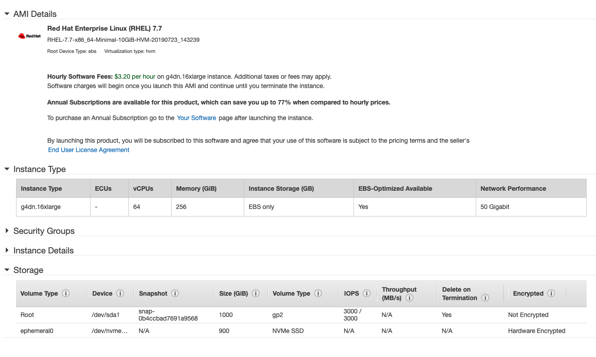

Install H2O Driverless AI on base RHEL7.7 on AWS EC2 Instances
=======================================================

> While this guide mentions about installing Driverless AI from scratch on Aws, it can be used on bare-metal machine or on any other cloud VM from the `Install Nvidia driver` step onwards.

Create base RHEL 7.7 Server
-----------------------------------

- **Select OS**
  - Login to Aws console and create a new EC2 compute instance.
  - Search for Rhel 7.7 AMI.
  - Select RHEL 7.7 AMI and start configuring the EC2 instance.
- **Select EC2 instance Type**
  - Choose the instance type For this exercise, we choose g4dn.16xlarge which
  has 1 GPU and 64 CPU cores. Consider the proper [EC2 instances type][1] based on your use case.
- **Configure Instance**
  - Configure instance setting for network, IAM role, suhtdwon polict etc., 
  as required.
- **Configure Storage**
  - SSD is recommended persistance store for Driverless AI.
  - For this setup, I installed DAI on the same disk where the OS is installed.
  - To increase the OS disk size, once the VM is running you will need to stop it.
  - If you are doing the RPM install, DAI will put the bulk of its data in the `/opt/h2oai/dai` directory. So if you are attaching an additional drive, ensure that you mount it at `/opt`.
  - If you are going with a docker based approach, you can mount the disk to any mount point as you will be mapping the host directories as volumes in the docker container. 
- **Configure Security Group**
  - Configure security group as needed.
  - At a minimum, ensure that your compute instance would have a public IP.
  - Configure the Network Security Group to allow incoming connections to port 22 (for SSH connection) and 12345 (for Driverless AI web UI).


> H2O Driverless AI uses Tensorflow built against CUDA 10.0, hence this is the recommended CUDA version to use. Per [Nvidia Compatibility Matrix][2], Nvidia driver version 384.XX is the minimum version needed and was the default when CUDA 9.0 was shipped. Per [Nvidia Hardware Support][3], driver 384.xx does not support the latest Turing architecture cards.
> The latest Nvidia Driver we have tested to work with CUDA 10.0 and Driverless AI is the 440.82+ branch. We install 450.XX in the steps below.

Install pciutils
----------------------

- Once the server is up, ssh to it.
- Disable SELINUX to avoid interference with Nvidia driver installation
```shell
sudo vi /etc/sysconfig/selinux
SELINUX=disabled
```
- Ensure GPU's are installed using pciutils. To install pciutils
```shell
sudo yum -y install pciutils
```
- Check to determine what GPU card is installed
```shell
lspci | grep -e VGA -ie NVIDIA
```
- The output of lspci should be something similar to 
```
00:02.0 VGA compatible controller: Intel Corporation 4th Gen ...
01:00.0 VGA compatible controller: Nvidia Corporation ...
```

Disable Nouveau driver
----------------------

- The `nouveau` driver is an alternative to the Nvidia driver that is generally installed on the server. It does not work with `CUDA` and needs to be disabled.
- If Nouveau drivers are installed and loaded, then you need to follow the steps for your Linux version to [Disable Nouveau Drivers][4]. For RHEL, the steps are

```shell
cat <<EOF | sudo tee /etc/modprobe.d/blacklist-nouveau.conf
blacklist nouveau
options nouveau modeset=0
EOF
```
- Update Grub to Blacklist Nouveau.
```shell
# Create a backup on grub config template
sudo cp /etc/sysconfig/grub /etc/sysconfig/grub.bak

#Then, update grub config template 
sudo vi /etc/sysconfig/grub

# Add rd.driver.blacklist=grub.nouveau to the GRUB_CMDLINE_LINUX variable. Example
GRUB_CMDLINE_LINUX="crashkernel=auto ... quiet rd.driver.blacklist=grub.nouvea"

```
- Rebuld grub config.
```
sudo grub2-mkconfig -o /boot/grub2/grub.cfg
```
- Regenerate the Initramfs Image.
```shell
sudo mv /boot/initramfs-$(uname -r).img /boot/initramfs-$(uname -r)-nouveau.img
sudo dracut /boot/initramfs-$(uname -r).img $(uname -r)
```
- Ensure to restart the server before proceeding ahead.
```
sudo reboot now
```
- Once server is up, ssh to it and ensure `Nouveau` driver is disabled.
```shell
# This command should print success
lsmod | grep "nouveau" > /dev/null && echo "WARNING: nouveau still active" ||echo "Success" 
```

Install Nvidia driver
----------------------------------
The installation steps are to be followed when EPEL repository and DKMS libraries need not to be installed on the server. These steps also require that the user has ssh'd into the server already.

- Add the tech preview repository. For detailed instructions refer[5].
```shell
sudo yum-config-manager --add-repo=http://developer.download.nvidia.com/compute/cuda/preview/repos/rhel7/x86_64/techpreview_nvidia_rh_drv.repo
```
- Install NVIDIA yum plugin.
```shell
sudo yum install yum-plugin-nvidia
```
- Verify that you have a supported kernel installed.
```
uname -r

# The above cmd should show a similar output
3.10.0-957.12.2.el7.x86_64
```

- Install required dependencies
```
sudo yum -y install kernel-devel kernel-headers gcc acpid make 
```
- Upgrade kernel and rebbot
```
sudo yum upgrade kernel
sudo reboot now
```
- Once server is up, ssh to the server
- Check Nvidia driver version
```
lspci | grep -e VGA -ie NVIDIA
```

- Navigate to [Nvidia Unix driver archive][6], and select `Linux x86_64` > `Latest Long Lived Branch`. Here we choose version `450.80.02`
- Select Download and it should download similar file `NVIDIA-Linux-x86_64-450.80.02.run`.
- Alternatively, on the ssh session, download the file using `wget <put the copied link here>` to the server.
- Install the downloaded package 
```shell
sudo chmod +x ./NVIDIA-Linux-$(uname -m)-*.run
sudo ./NVIDIA-Linux-$(uname -m)-*.run
```
- At this point you will need to restart the machine. This will ensure that nvidia drivers are correctly loaded to the kernel.

Set Nvidia Persistance mode
---------------------------

- Driverless AI requires the persistance mode to be enabled on each GPU that would be used with DAI
- To manually enable persistance mode on all GPUs issue the command `sudo nvidia-smi -pm 1`
- To validate, issue the command `nvidia-smi` and verify that persistance mode setting is turned ON.

> At this point your system setup tasks are completed. You can now proceed with a native rpm package install of Driverless AI or proceed to install `Docker CE` and `nvidia-runtime` for a docker based installation of Driverless AI.

Install Driverless AI native RPM package
----------------------------------------

- If you want docker container based Driverless AI install, skip this section and proceed from Install Docker CE onwards.
- If you want a deb based install, follow the steps in this section and do not follow any of the docker installation sections below.
- [Download latest Driverless AI][8] rpm package from [https://www.h2o.ai/download/#driverless-ai][8]. You can get the URL and issue the command `wget <paste URL here>` to download the file.
- Issue the command `sudo rpm -i <dai file downloaded>.rpm` to install Driverless AI.
- Proceed to Driverless AI documentation to understand the steps to [manage Driverless AI i.e. start, stop, uninstall, update]

Great, you should be done with native installation of Driverless AI.

Follow on from here in case you are doing a Docker install for H2O Driverless AI

Install Docker CE
-----------------

- Using redhat subscription manager check if repository exists. Refer to the gist[10] for detailed information
```
subscription-manager repos --list | grep -i extras
```
- Enable the repository
```
sudo subscription-manager repos --enable rhel-7-server-extras-rpms
```
- List docker packages
```
sudo yum list "*docker*"
```
- Install docker
```
sudo yum -y install docker
```
- Start docker and check docker version
```
sudo systemctl start docker.service
docker -v
```
- Stop docker
```
sudo systemctl stop docker.service
```

Install nvidia-docker
----------------------

- Ensure docker is started and runs.
```
sudo systemctl start docker && sudo systemctl enable docker
```

- Setup the stable repository and the GPG key
```shell
distribution=$(. /etc/os-release;echo $ID$VERSION_ID)
curl -s -L https://nvidia.github.io/nvidia-docker/$distribution/nvidia-docker.repo | sudo tee /etc/yum.repos.d/nvidia-docker.repo
```
- Install nvidia-docker
```shell
sudo yum install nvidia-docker
```
- Install nvidia-container-toolkit package
```shell
sudo yum clean expire-cache
sudo yum install nvidia-container-toolkit -y
```
- Restart docker and test setup using a base CUDA container
```shell
sudo systemctl restart docker
sudo docker run --rm -e NVIDIA_VISIBLE_DEVICES=all nvidia/cuda:11.0-base nvidia-smi

```
- This completes nvidia-docker installation.
[nvidia-docker install reference][11]

Install H2O Driverless AI as docker
-----------------------------------

- [Download latest Driverless AI][12] docker image from [https://www.h2o.ai/download/#driverless-ai][12]
- Load the download image to docker using command `docker load < dai_image_name.tar.gz`. Substitute the correct file name.
- Proceed with [installing Driverless AI][13] following the directions step 5 onwards on that page.

[1]: https://aws.amazon.com/emr/pricing/
[2]: https://docs.nvidia.com/deploy/cuda-compatibility/index.html#binary-compatibility__table-toolkit-driver
[3]: https://docs.nvidia.com/deploy/cuda-compatibility/index.html#support-hardware
[4]: https://docs.nvidia.com/cuda/archive/9.0/cuda-installation-guide-linux/index.html#runfile-nouveau
[5]: http://developer.download.nvidia.com/compute/cuda/preview/repos/rhel7/x86_64/README.html
[6]: https://www.nvidia.com/en-us/drivers/unix/
[7]: https://docs.nvidia.com/deploy/driver-persistence/index.html#usage
[8]: https://www.h2o.ai/download/#driverless-ai
[9]: http://docs.h2o.ai/driverless-ai/latest-stable/docs/userguide/install/linux-rpm.html#installing-driverless-ai
[10]: https://gist.github.com/WelshSean/d55289acba43d9c305fbffda2befe201
[11]: https://docs.nvidia.com/datacenter/cloud-native/container-toolkit/install-guide.html#installing-on-rhel-7
[12]: https://www.h2o.ai/download/#driverless-ai
[13]: http://docs.h2o.ai/driverless-ai/latest-stable/docs/userguide/install/rhel.html#install-on-rhel-with-gpus