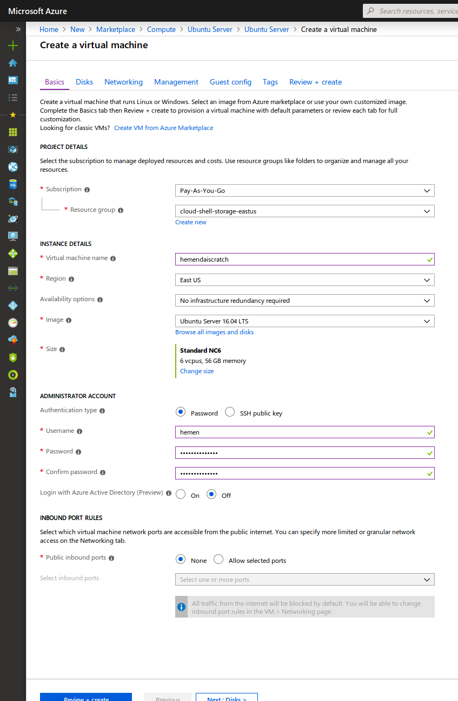

Install H2O Driverless AI on base Ubuntu 16.04 on Azure
=======================================================

> While this guide mentions about installing Driverless AI from scratch on Azure, it can be used on bare-metal machine or on any other cloud VM from the `Install Nvidia driver` step onwards.

Create base Ubuntu 16.04 LTS Server
-----------------------------------

- **Select OS**
  - Login to Azure console and create a new compute instance.
  - Select Ubuntu Server provided by Canonical.
  - Select Ubuntu version as 16.04 LTS and [Deployment Method][1] as Resource Manager.
- **Select Azure VM Size**
  - Provide necessary details like VM Name, Regions etc. as applicable to your Azure subscription.
  - Most important selection here is the Instance Size. For this exercise I selected the least costly instance with a GPU card NC6 as seen in the image below. Consider the proper [Azure instance sizing recommendation][4] based on your use case.

- **Configure authentication**
  - Configure authentication settings either using password or public-private key pair.
- **Configure Storage**
  - SSD is recommended persistance store for Driverless AI.
  - For this setup, I installed DAI on the same disk where the OS is installed.
  - By default, Azure VMs are configured with OS disk size of 30GB approx. This is not sufficient for DAI.
  - To increase the OS disk size, once the VM is running you will need to stop it. Once stopped, resize the OS disk partition to at-least 500GB and then restart the server.
  - If you are doing the DEB install, DAI will put the bulk of its data in the `/opt/h2oai/dai` directory. So if you are attaching an additional drive, ensure that you mount it at `/opt`.
  - If you are going with a docker based approach, you can mount the disk to any mount point as you will be mapping the host directories as volumes in the docker container. 
  - **For real use cases** it is strongly recommended to not persist any application information on the OS drive, but to [attach a data disk to the Azure VM][5] and to use this data drive for persisting DAI information. Premium SSD are recommended.
- **Configure Networking**
  - Configure networking as needed.
  - At a minimum, ensure that your compute instance would have a public IP.
  - Configure the Network Security Group to allow incoming connections to port 22 (for SSH connection) and 12345 (for Driverless AI web UI).
- I accepted defaults for Monitoring and Management options, but you can configure as your need.
- **Guest Configs**
  - Azure provides capability to install Nvidia drivers and CUDA libraries as a guest extension.
  - I decided to install Nvidia drivers and CUDA manually to ensure that everything is compatible and per our preference.

> H2O Driverless AI uses Tensorflow 1.11 built against CUDA 9.0, hence this is the recommended CUDA version to use. Per [Nvidia Compatibility Matrix][6], Nvidia driver version 384.XX is the minimum version needed and was the default when CUDA 9.0 was shipped. Per [Nvidia Hardware Support][15], driver 384.xx does not support the latest Turing architecture cards.
> The latest Nvidia Driver we have tested to work with CUDA 9.0 and Driverless AI is the 418.39+ branch. We install 418.XX in the steps below.

Disable Nouveau driver
----------------------

- Once the server is up, ssh to it.
- Run the following commands to get it up to date
  - `sudo apt-get update`
  - `sudo apt-get upgrade`
- Check if `nouveau` nvidia driver is installed on the system `sudo lsmod | grep nouveau`.
- If the above command does not return anything, then you dont have Nouveau drivers installed and can proceed to install Nvidia drivers.
- On the other hand, if Nouveau drivers are installed and loaded, then you need to follow the steps for your Linux version to [Disable Nouveau Drivers][16]. For Ubuntu, the steps are

```shell
sudo touch /etc/modprobe.d/blacklist-nouveau.conf
sudo echo 'blacklist nouveau' >> /etc/modprobe.d/blacklist-nouveau.conf
sudo echo 'options nouveau modeset=0' >> /etc/modprobe.d/blacklist-nouveau.conf
sudo update-initramfs -u
```

- Ensure to restart the server before proceeding ahead.

Install Nvidia driver and Cuda 9.0
----------------------------------

- Once the server is up, ssh to it.
- Navigate to [Nvidia CUDA download archive][7], and select `Linux` > `x86_64` > `Ubuntu` > `16.04` > `deb (network)`.
- Copy the link to the `cuda-repo-ubuntu1604_9.0.176-1_amd64.deb` file.
- On the ssh session, download the file using `wget <put the copied link here>` to the server.
- Install the downloaded package `sudo dpkg -i cuda-repo-ubuntu1604_9.0.176-1_amd64.deb`
- Add the apt key `sudo apt-key adv --fetch-keys http://developer.download.nvidia.com/compute/cuda/repos/ubuntu1604/x86_64/7fa2af80.pub`
- Update the apt package list `sudo apt-get update`
- We install CUDA 9.0 and the requisite Nvidia driver using [CUDA Meta-packages][8]. To install needed meta-packages issue command `sudo apt install cuda-9-0`
- The above step would install CUDA libraries in `/usr/local/cuda` directory, where `cuda` is a soft link to the currently used CUDA version. This means that one can install more than one CUDA versions on the same machine.
- At this point you will need to restart the machine. This will ensure that nvidia drivers are correctly loaded to the kernel.

Check CUDA installation
-----------------------

- Once the machine restarts, check if Nvidia drivers are correctly loaded in the kernel `lsmod | grep nvidia` should result in some output. Also, issue the command `nvidia-smi` to check if the GPUs are correctly detected. If you get a response for both these commands, your Nvidia driver is vaildated to be installed correctly.
- We update `$PATH` to include the CUDA `bin` directory. Issue the command `export PATH=/usr/local/cuda/bin:$PATH`.
- To validate CUDA installation we will install CUDA sample code in `$HOME` directory, compile a CUDA program and test if it works. In the below steps we compile the `deviceQuery` sample and execute it. If it displays details about the CUDA interface and GPU details then we have successfully installed CUDA library

```shell
cd $HOME
cuda-install-samples-9.0.sh .
cd NVIDIA_Sam*
cd 1_Utilities/deviceQuery
make
./deviceQuery
```

- If the output of `deviceQuery` shows the GPUs installed on the system then CUDA is validated to be installed as expected.

Install cuDNN
-------------

- To install cuDNN issue the below commands

```shell
cd $HOME
wget https://s3-us-west-2.amazonaws.com/h2o-internal-release/libcudnn7_7.3.1.20-1%2Bcuda9.0_amd64.deb
wget https://s3-us-west-2.amazonaws.com/h2o-internal-release/libcudnn7-doc_7.3.1.20-1%2Bcuda9.0_amd64.deb
wget https://s3-us-west-2.amazonaws.com/h2o-internal-release/libcudnn7-dev_7.3.1.20-1%2Bcuda9.0_amd64.deb

sudo dpkg -i libcudnn7_7.3.1.20-1+cuda9.0_amd64.deb
sudo dpkg -i libcudnn7-dev*.deb
sudo dpkg -i libcudnn7-doc*.deb
```

Set Nvidia Persistance mode
---------------------------

- Driverless AI requires the persistance mode to be enabled on each GPU that would be used with DAI
- To manually enable persistance mode on all GPUs issue the command `sudo nvidia-smi -pm 1`
- To validate, issue the command `nvidia-smi` and verify that persistance mode setting is turned ON.
- We recommend setting up [Nvidia Persistance daemon][12] to manage the persistance mode setting so that you do not need to set it up after each restart. This would require you to setup a service based on the init system on your machine. For systemd, which should be available on Ubuntu 16.04 the steps are as below
  - Create a file `/etc/systemd/system/nvidia-persistenced.service`
  - The contents of the above file should be from https://raw.githubusercontent.com/NVIDIA/nvidia-persistenced/master/init/systemd/nvidia-persistenced.service.template
  - Replace text `__USER__` in the line that starts with ExecStart ...... with `nvidia-persistenced`.
  - Save the file.
  - Reload the changes in systemd `sudo systemctl daemon-reload`.
  - Enable the service to start during server startup `sudo systemctl enable nvidia-persistenced`
  - Start the service `sudo systemctl start nvidia-persistenced`
  - If you want to test this, you can restart the server at this point and check for the value of persistance mode using `nvidia-smi` command.

Install OpenCL
--------------

- OpenCL is required for LightGBM to run on GPUs.

```shell
sudo apt-get install opencl-headers clinfo ocl-icd-opencl-dev
mkdir -p /etc/OpenCL/vendors && \
    echo "libnvidia-opencl.so.1" > /etc/OpenCL/vendors/nvidia.icd
```

> At this point your system setup tasks are completed. You can now proceed with a native deb package install of Driverless AI or proceed to install `Docker CE` and `nvidia-docker` for a docker based installation of Driverless AI.

Install Driverless AI native DEB package
----------------------------------------

- If you want docker container based Driverless AI install, skip this section and proceed from Install Docker CE onwards.
- If you want a deb based install, follow the steps in this section and do not follow any of the docker installation sections below.
- [Download latest Driverless AI][14] deb package from [https://www.h2o.ai/download/#driverless-ai][14]. You can get the URL and issue the command `wget <paste URL here>` to download the file.
- Issue the command `sudo dpkg -i <dai file downloaded>.deb` to install Driverless AI.
- Proceed to Driverless AI documentation to understand the steps to [manage Driverless AI i.e. start, stop, uninstall, update][17]

Great, you should be done with native installation of Driverless AI.

Follow on from here in case you are doing a Docker install for H2O Driverless AI

Install Docker CE
-----------------

- Update the system `sudo apt-get update`
- Install needed packages `sudo apt install apt-transport-https ca-certificates curl gnupg-agent software-properties-common`
- Add docker GPG key `curl -fsSL https://download.docker.com/linux/ubuntu/gpg | sudo apt-key add -`
- Verify fingerprint is of docker `sudo apt-key fingerprint 0EBFCD88`
- Add repository

```shell
sudo add-apt-repository \
   "deb [arch=amd64] https://download.docker.com/linux/ubuntu \
   $(lsb_release -cs) \
   stable"
```

- Update the packages again `sudo apt update`
- Install docker `sudo apt-get install docker-ce docker-ce-cli containerd.io`
- To execute docker commands the user needs to be part of the `docker` group. To add the user to the `docker` group issue the command `usermod -aG docker $USER`
- Exit your shell and reconnect. 
- Issue the command `id`, and verify the user is part of `docker` group.
- To verify all is ok issue the command `docker run --rm hello-world`. It will pull a docker image from the docker hub and finally display a `Hello World` message 

[Docker installation reference][9]

Install nvidia-docker2
----------------------

- To install nvidia-docker2, we need to get the repository added to the apt list [Reference][10]

```shell
curl -s -L https://nvidia.github.io/nvidia-docker/gpgkey | \
  sudo apt-key add -
distribution=$(. /etc/os-release;echo $ID$VERSION_ID)
curl -s -L https://nvidia.github.io/nvidia-docker/$distribution/nvidia-docker.list | \
  sudo tee /etc/apt/sources.list.d/nvidia-docker.list
sudo apt-get update
```

- Next, install nvidia-docker2 using the command `sudo apt install nvidia-docker2`
- Restart the docker daemon using the command `sudo pkill -SIGHUP dockerd`
- To validate, execute the command `nvidia-docker2 run --rm nvidia/cuda nvidia-smi` and this should give you desired output. It is critical to make note of the value of persistance mode being detected withing the docker environment. Ensure that the value is `ON` and not `OFF`.

[nvidia-docker2 install reference][11]

Install H2O Driverless AI as docker
-----------------------------------

- [Download latest Driverless AI][14] docker image from [https://www.h2o.ai/download/#driverless-ai][14]
- Load the download image to docker using command `docker load < dai_image_name.tar.gz`. Substitute the correct file name.
- Proceed with [installing Driverless AI][13] following the directions step 5 onwards on that page.

[1]: https://docs.microsoft.com/en-us/azure/azure-resource-manager/resource-manager-deployment-model
[2]: https://docs.microsoft.com/en-us/azure/virtual-machines/linux/n-series-driver-setup
[3]: https://docs.microsoft.com/en-us/azure/virtual-machines/extensions/hpccompute-gpu-linux
[4]: http://docs.h2o.ai/driverless-ai/latest-stable/docs/userguide/install/azure.html#environment
[5]: https://docs.microsoft.com/en-us/azure/virtual-machines/linux/attach-disk-portal
[6]: https://docs.nvidia.com/deploy/cuda-compatibility/index.html#binary-compatibility__table-toolkit-driver
[7]: https://developer.nvidia.com/cuda-90-download-archive
[8]: https://docs.nvidia.com/cuda/cuda-installation-guide-linux/index.html#package-manager-metas
[9]: https://docs.docker.com/install/linux/docker-ce/ubuntu/
[10]: https://nvidia.github.io/nvidia-docker/
[11]: https://github.com/nvidia/nvidia-docker/wiki/Installation-(version-2.0)#installing-version-20
[12]: https://docs.nvidia.com/deploy/driver-persistence/index.html#usage
[13]: http://docs.h2o.ai/driverless-ai/latest-stable/docs/userguide/install/ubuntu.html
[14]: https://www.h2o.ai/download/#driverless-ai
[15]: https://docs.nvidia.com/deploy/cuda-compatibility/index.html#support-hardware
[16]: https://docs.nvidia.com/cuda/archive/9.0/cuda-installation-guide-linux/index.html#runfile-nouveau
[17]: http://docs.h2o.ai/driverless-ai/latest-stable/docs/userguide/install/linux-deb.html#starting-driverless-ai